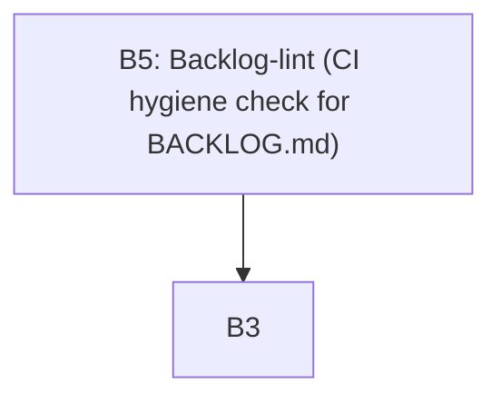

# Backlog views

<!-- generated by scripts/backlog_view.py --write; do not edit by hand -->

_A read-only projection of `BACKLOG.md`. Regenerate: `python3 scripts/backlog_view.py --write`._

## Ready & unblocked

| id | title | owner |
|---|---|---|
| B1 | Convention-setting exercise | Jean |
| B2 | Workshop process + feedback iteration | Watson |
| B4 | Time-boxing PRDs / working sessions | Arya |
| B6 | Decide the context-gc plugin's author identity | Watson |
| B7 | Pin the context-gc provenance reference to a URL and sha | Watson |
| B8 | Correct the flush-regression test's platform in its title | Watson |

## By owner

### Arya
- B4 — Time-boxing PRDs / working sessions (S, ready)

### Jean
- B1 — Convention-setting exercise (M, ready)

### Kiara
- B3 — Lab-wide backlog (this file) (S, in-progress)
- B5 — Backlog-lint (CI hygiene check for BACKLOG.md) (M, in-progress)

### Watson
- B2 — Workshop process + feedback iteration (M, ready)
- B6 — Decide the context-gc plugin's author identity (S, ready)
- B7 — Pin the context-gc provenance reference to a URL and sha (S, ready)
- B8 — Correct the flush-regression test's platform in its title (S, ready)

## Dependency graph

_Edge `A --> B` reads "A depends on B"._
