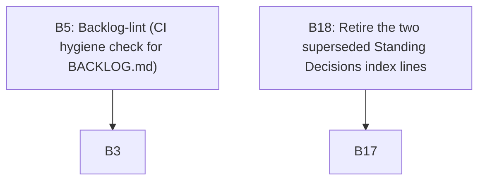

# Backlog views

<!-- generated by scripts/backlog_view.py --write; do not edit by hand -->

_A read-only projection of `BACKLOG.md`. Regenerate: `python3 scripts/backlog_view.py --write`._

## Ready & unblocked

| id | title | owner |
|---|---|---|
| B1 | Convention-setting exercise | Jean |
| B2 | Workshop process + feedback iteration | Watson |
| B4 | Time-boxing PRDs / working sessions | Arya |
| B10 | Give main-PRD success criterion 4 an applicable test | Watson |
| B11 | Decide whether main `plan.md` §In flight restates or links | Watson |
| B12 | Decide whether the main-bundle log template needs a non-fold entry grammar | Watson |
| B13 | Dispose of the superseded `templates/PRD.template.md` | Watson |
| B14 | Record the never-required constraint on path-filtered CI jobs | Watson |
| B15 | Check `_specs/lab-os/` bundle statuses mechanically | Watson |
| B16 | Dispose of the legacy `docs/` planning surfaces | Watson |
| B17 | Archive the `project_log.md` overflow (time-critical) | Watson |
| B19 | Amend `04-docs.md` for the main bundle's `**Living**` header | Watson |

## By owner

### Arya
- B4 — Time-boxing PRDs / working sessions (S, ready)

### Jean
- B1 — Convention-setting exercise (M, ready)

### Kiara
- B3 — Lab-wide backlog (this file) (S, in-progress)
- B5 — Backlog-lint (CI hygiene check for BACKLOG.md) (M, in-progress)

### Watson
- B2 — Workshop process + feedback iteration (M, ready)
- B10 — Give main-PRD success criterion 4 an applicable test (S, ready)
- B11 — Decide whether main `plan.md` §In flight restates or links (S, ready)
- B12 — Decide whether the main-bundle log template needs a non-fold entry grammar (S, ready)
- B13 — Dispose of the superseded `templates/PRD.template.md` (S, ready)
- B14 — Record the never-required constraint on path-filtered CI jobs (S, ready)
- B15 — Check `_specs/lab-os/` bundle statuses mechanically (M, ready)
- B16 — Dispose of the legacy `docs/` planning surfaces (M, ready)
- B17 — Archive the `project_log.md` overflow (time-critical) (S, ready)
- B18 — Retire the two superseded Standing Decisions index lines (S, ready)
- B19 — Amend `04-docs.md` for the main bundle's `**Living**` header (M, ready)

## Dependency graph

_Edge `A --> B` reads "A depends on B"._
